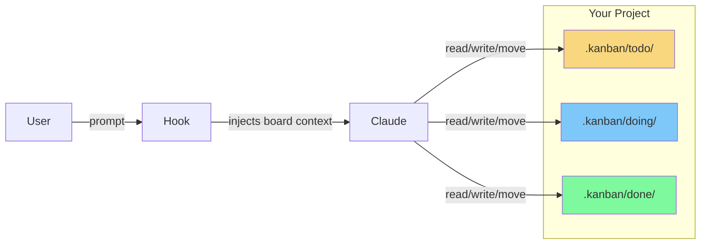

# Claude Kanban

Filesystem-based kanban board for Claude Code. No servers, just folders.



## Install

```
claude plugin install github:dylangroos/claude-kanban
```

## Setup

After installing the plugin, initialize a board in your project:
```
/kanban-init
```

Or manually: `mkdir -p .kanban/{todo,doing,done}`

## Use

```
/kanban              # view board
/kanban add <task>   # add task
/kanban done <task>  # mark done
/kanban move <task> doing
```

Or natural language:
- "show my board"
- "add a task to fix the login"
- "move refactor-api to done"

## Structure

```
.kanban/
├── todo/              # to do
├── doing/             # in progress
└── done/              # complete
```

## Cards

Filename = task (`fix-bug.md`). Content = description.

```markdown
Users can't log in on Safari.
```

Optional priority:
```markdown
---
p: high
---
Users can't log in on Safari.
```

## Agents

**task-planner** - Break down big features into cards:
- "plan out the authentication system"
- "break this feature into tasks"

**standup** - Get a status report:
- "what's the status?"
- "give me a standup"

## Why

- Zero infrastructure
- Human-readable (just browse the folders)
- Git-friendly (branch boards, track changes)
- Works offline
- Auto-context hook makes board salient to Claude

## License

MIT
